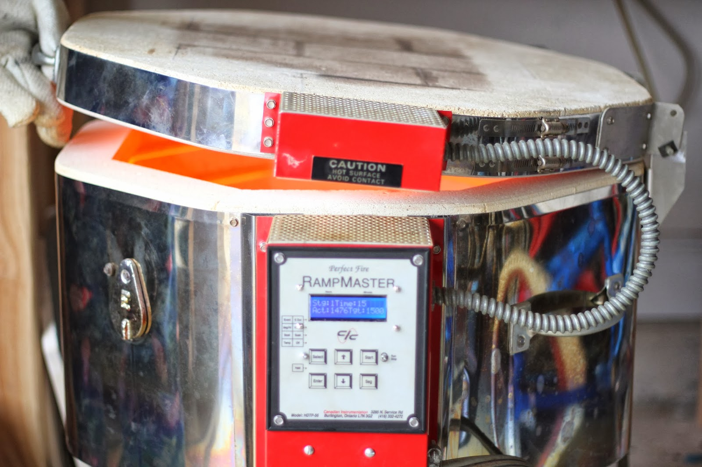
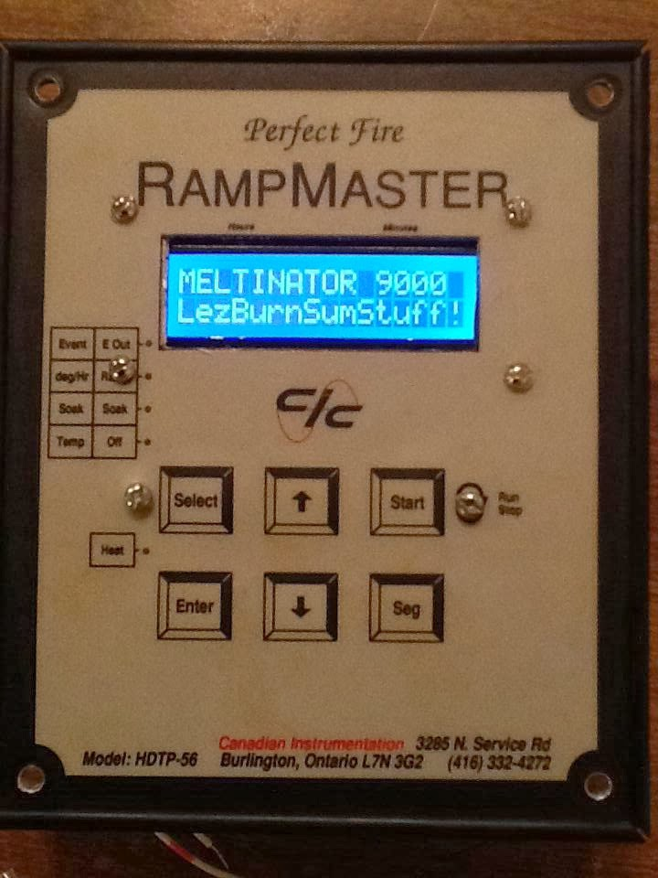

MELTINATOR-9000

Richard Moore
February 12, 2014

This is a temperature controller for a glass fusing kiln.  It runs on an Arduino Uno board using an Adafruit display shield, a thermocouple reader, six tactile switches, and a relay driving circuit.

25 different firing schedules can be stored in the EEPROM.  Each firing schedule program consists of 10 steps with each have a target temperature, a heating/cooling rate, and a hold time.  

Use at your own risk.  No warranty expressed or implied.  

